# 💰 Controle de Finanças

Sistema web desenvolvido para gerenciamento financeiro pessoal, permitindo controlar pagamentos, investimentos e dividendos de forma organizada, com visão mensal e anual dos dados.

<div align="center">
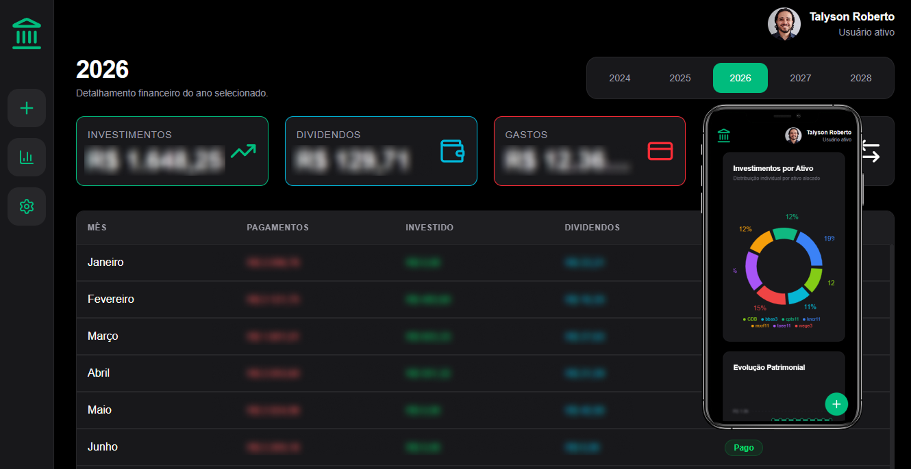
<br/>


</div>

## 🚀 Objetivo

O projeto tem como finalidade centralizar e organizar todas as movimentações financeiras, permitindo acompanhar:

- Pagamentos mensais
- Investimentos realizados
- Dividendos recebidos
- Gastos por proprietário
- Evolução financeira ao longo do tempo
- Indicadores e gráficos financeiros

---

### Login

Login para acessar o sistema

<p align="center">
  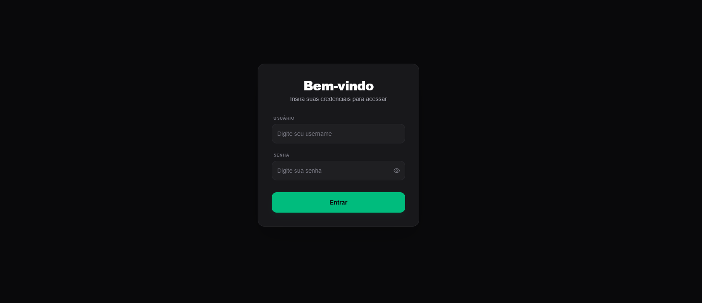
  
</p>

---

### Home

Pagina geral

<p align="center">
  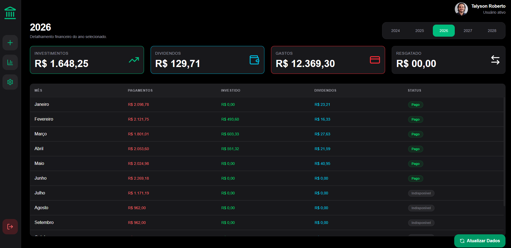
  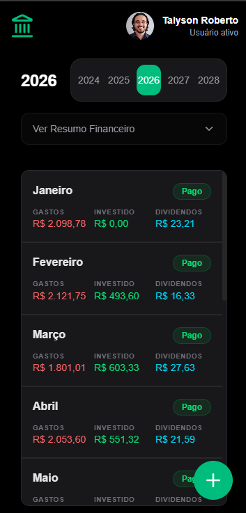
</p>

---

### Mês

Acessa o mês individualemente

<p align="center">
  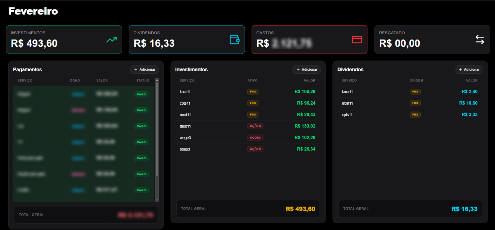
  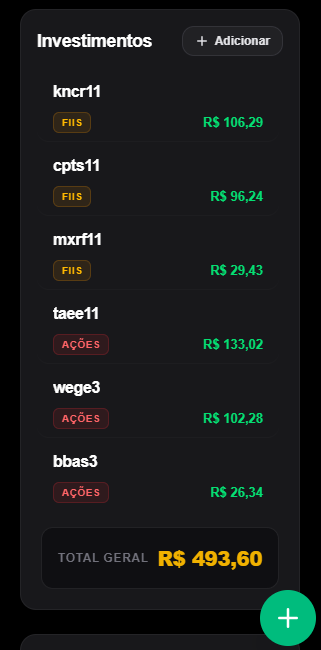
</p>

---

### Gráfico

Acessa os graficos

<p align="center">
  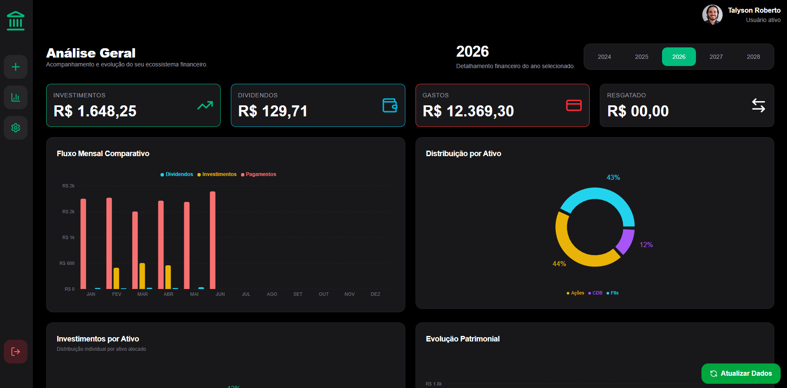
  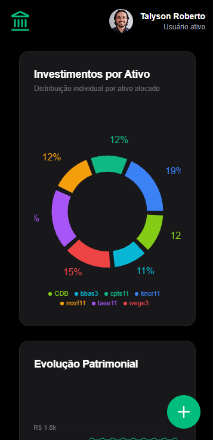
</p>

---

### Modais

<p align="center">
  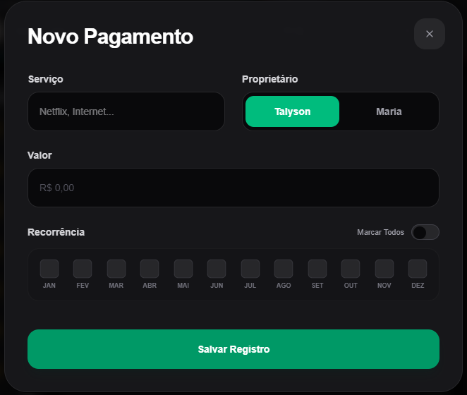
  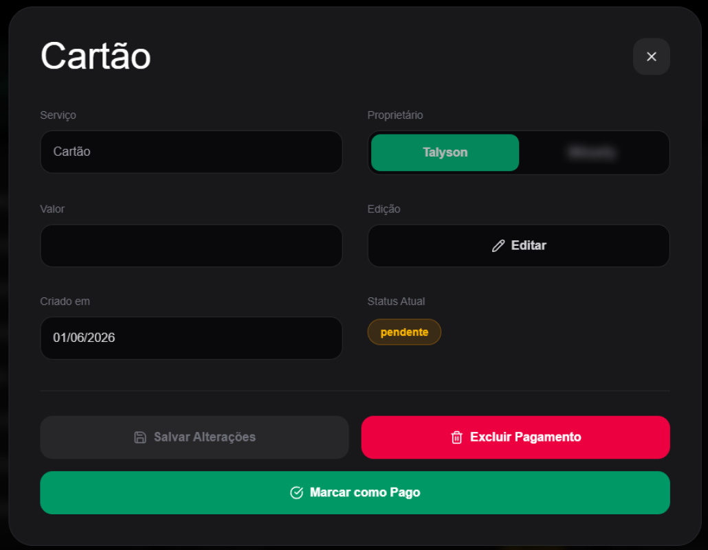
  
  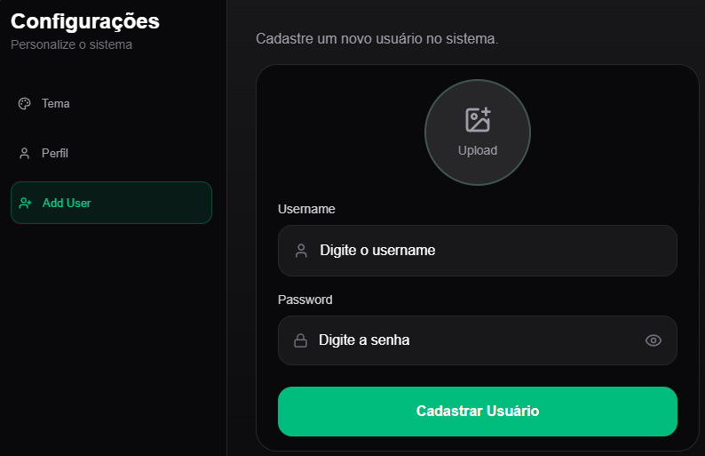
  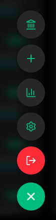
</p>

---

## ✨ Funcionalidades

### 📋 Gestão de Pagamentos

- Cadastro de pagamentos recorrentes
- Definição do responsável pelo pagamento
- Controle de status:
  - Pendente
  - Pago

- Seleção de recorrência:
  - Ano inteiro
  - Meses específicos

- Edição de pagamentos
- Exclusão de pagamentos

### 📈 Gestão de Investimentos

- Cadastro de investimentos
- Classificação por categoria:
  - Crypto
  - FIIs
  - CDB
  - Tesouro Direto
  - Ações
  - LCI/LCA
  - ETFs

- Controle de valores investidos
- Atualização e exclusão de registros

### 💵 Gestão de Dividendos

- Registro de dividendos recebidos
- Controle mensal de recebimentos
- Atualização e exclusão de registros

### 📊 Dashboard Financeiro

Visualização completa dos dados financeiros através de:

- Tabelas mensais
- Resumo financeiro
- Indicadores de gastos
- Indicadores de investimentos
- Indicadores de dividendos

### 📉 Gráficos

O sistema possui diversos gráficos para análise financeira:

- Evolução financeira
- Comparativo mensal
- Distribuição de gastos
- Distribuição por tipo de investimento
- Distribuição por instituição ou ativo
- Comparação entre investimentos e dividendos

---

## 👥 Controle por Proprietário

Cada pagamento pode ser associado a um responsável.

Atualmente o sistema permite identificar facilmente quem é responsável por cada despesa, facilitando o controle financeiro compartilhado.

Exemplos:

- Talyson
- Maria

---

## 🔐 Autenticação

O sistema possui autenticação de usuários integrada ao Supabase.

Funcionalidades:

- Login de usuários
- Cadastro de usuários
- Atualização de perfil
- Upload de avatar
- Controle de acesso às páginas protegidas

---

## 🗄️ Banco de Dados

O projeto utiliza:

### Supabase

Responsável por:

- Banco de dados PostgreSQL
- Armazenamento de imagens (Storage)
- Gerenciamento de usuários
- Operações CRUD

---

## 🛠️ Tecnologias Utilizadas

### Front-end

- Next.js
- React
- TypeScript
- Tailwind CSS

### Back-end

- Supabase

### Bibliotecas

- Lucide React
- Supabase JS

---

## 📂 Estrutura do Projeto

```text
app/
├── (dashboard)
│   ├── home
│   ├── grafico
│   └── mes/[id]
│
├── login
│
components/
├── AddUser
├── FinanceModal
├── PaymentDetailsModal
├── Sidebar
├── Header
└── DashboardCards

services/
├── authService
├── paymentService
├── investimentoService
├── dividendoService
├── financeService
└── userService

lib/
└── supabase.ts
```

---

## 🔄 Operações CRUD

O sistema implementa operações completas de CRUD para:

### Usuários

- Criar
- Listar
- Atualizar
- Excluir

### Pagamentos

- Criar
- Listar
- Atualizar
- Excluir

### Investimentos

- Criar
- Listar
- Atualizar
- Excluir

### Dividendos

- Criar
- Listar
- Atualizar
- Excluir

---

## ⚙️ Instalação

Clone o repositório:

```bash
git clone https://github.com/seu-usuario/controle-de-financas.git
```

Acesse a pasta:

```bash
cd controle-de-financas
```

Instale as dependências:

```bash
npm install
```

Configure as variáveis de ambiente:

```env
NEXT_PUBLIC_SUPABASE_URL=SEU_SUPABASE_URL
NEXT_PUBLIC_SUPABASE_ANON_KEY=SUA_CHAVE_ANON
```

Execute o projeto:

```bash
npm run dev
```

Build de produção:

```bash
npm run build
```

---

## 📸 Interface

O sistema possui interface moderna desenvolvida com Tailwind CSS, focada em:

- Responsividade
- Organização visual
- Facilidade de uso
- Visual profissional
- Experiência otimizada para gerenciamento financeiro

---

## 📄 Licença

Projeto desenvolvido para fins de estudo, organização financeira pessoal e aprimoramento de conhecimentos em desenvolvimento web utilizando Next.js, TypeScript e Supabase.

# 👨‍💻 Créditos

Desenvolvido por [Talyson Roberto](https://github.com/talysonroberto)
